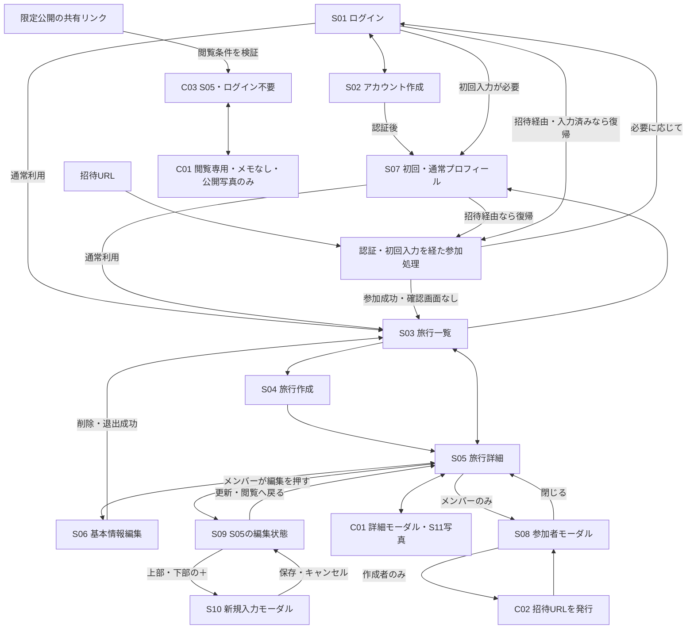

# MVP画面設計

## 1. 目的と位置付け

旅行帳のMVPに必要な画面の役割、表示情報、操作、画面遷移、URL構成を整理する。モバイル利用を主軸とし、計画・旅行中・旅行後に同じ旅行と旅程を使い続ける。

参照資料：

- [product.md](./product.md)：プロダクト思想
- [requirements.md](./requirements.md)：ユーザー向け仕様
- [data_model.md](./data_model.md)：論理データモデル
- [db-implementation.md](./db-implementation.md)：DB制約、RLS、Storage
- [decisions.md](./decisions.md)：設計判断の記録
- [AGENTS.md](../AGENTS.md)：開発上のルール

本書には、今回確定した画面構成・保存方法・公開範囲を反映する。画面構成が確定していても、URLの具体的な綴り、UIの細部、残る権限・入力仕様まで実装済みという意味ではない。UIライブラリ・配色・実装コードは決めない。

「機能面」は独立ページに限らず、同一ページの編集状態やモーダル内の機能を含む。S09・S11などのIDは機能の対応を追えるよう残すが、独立画面は作らない。C01〜C03も候補という意味ではなく、確定した詳細・招待・閲覧機能の識別子として使用する。

後の補足を優先し、**非メンバーはS08を閲覧できない。S05で人数のみ確認でき、C01のメモも閲覧できない。限定公開の共有リンクからの閲覧にログインは不要**とする。当初の「C03からS08も閲覧可能」という案は採用しない。

本書の確定事項は関連する要件・論理モデル・DB設計・判断記録へ反映している。第9節に資料の対応と残る実装設計事項を示す。初期migrationは作成・隔離環境で検証済み。実Supabaseへの適用・履歴確認は利用者が完了。S01・S02・S07の表示名入力と認証フローを実装済み。旅行画面は未実装。実装範囲は [DB実装設計](./db-implementation.md) 第11節を参照する。

## 2. MVPの画面・機能面一覧

| ID | 画面・機能面 | 確定した構成 | URLルート案・所属先 |
| --- | --- | --- | --- |
| S01 | ログイン | 独立ページ | `/login` |
| S02 | アカウント作成 | 独立ページ | `/signup` |
| S03 | 旅行一覧 | 複数旅行への入口となるページ | `/trips` |
| S04 | 旅行作成 | 独立ページ | `/trips/new` |
| S05 | 旅行詳細・日別旅程 | 旅行の中心ページ。「編集」で旅程を編集可能にする | `/trips/[tripId]` |
| S06 | 旅行基本情報編集 | 独立ページ | `/trips/[tripId]/settings` |
| S07 | 自分のプロフィール | 初回入力と通常の編集で共用するページ | `/profile` |
| S08 | 参加メンバー一覧 | S05上のモーダル。メンバーのみ利用可能 | S05のURL内 |
| S09 | 旅程編集 | 独立画面なし。S05の編集モードとして実現 | S05のURL内 |
| S10 | 旅程アイテム追加 | リスト上部・下部の＋から、カテゴリ選択→内容入力→挿入箇所選択。新規入力モーダルに保存・キャンセルを設ける | S05の編集モード内 |
| S11 | 写真閲覧・追加・編集・振り返り | C01に内包。専用写真一覧・振り返りページは作らない | C01内 |
| C01 | 旅程アイテム詳細 | 1アイテムの詳細モーダル。メモ・写真機能を内包 | S05のURL内 |
| C02 | メンバー招待・参加 | 作成者がS08から招待。受け取る人は招待URLから参加 | 招待操作はS08内。参加URLの形式は未決定 |
| C03 | 非メンバー向け閲覧 | MVPは限定公開。共有リンクの閲覧条件を満たせばログイン不要。S05とC01は閲覧専用、S08・メモは非公開 | 同じ `/trips/[tripId]` に閲覧資格を引き継ぐ案 |

独立ページの採否、S07の初回共用、S08・C01のモーダル化、S09・S11の内包先は確定事項とする。不要になった旅程編集・アイテム詳細・写真一覧・メンバー一覧の独立ルートは設けない。モーダルの開閉状態をクエリ等で表すかは未決定。

管理画面、公開旅行検索、SNS、複数メモの投稿、旅行の複製、地図・交通検索、AIプラン、天気、アカウント削除など、今回のMVP要件にない機能・画面は追加しない。

## 3. 共通の表示・操作方針

### 3.1 モバイル利用

- 旅行名・選択日・操作対象が分かる縦方向中心の構成とし、ホバー操作を前提にしない。
- 日付切替は旅程一覧上部のタブを基本とする。長い旅行でのスクロール方法やプルダウンへの切替条件は未決定。
- S08・C01と新規入力はモーダルで扱う。小さな端末で十分な入力・閲覧領域を確保し、閉じる操作と保存結果を区別する。モーダルの大きさや内部の画面切替は未決定。
- 並び替えの操作方法は未決定。ドラッグ＆ドロップ・上下移動ボタン等から、タッチ操作に適した方法を決める。
- 読み込み中・未保存・保存中・成功・失敗を区別する。保存できていない内容を成功扱いにしない。

### 3.2 旅程の基本表示

同じ旅行・日付では `sort_order` によるユーザー指定順を正式な順序とする。`place` と `transportation` を1つの連続した旅程として表示する。時刻・時間帯・推定時刻を理由に並び替えない。

| ユーザー指定順 | 種別 | 内容 | 補助情報の例 |
| --- | --- | --- | --- |
| 1 | place | 東京駅 | 09:00 |
| 2 | transportation | 新幹線 | 所要時間120分 |
| 3 | place | ホテルに荷物を預ける | 時刻指定なし |
| 4 | place | 昼食 | 設定した時間帯 |

時刻がなくても通常のアイテムとして同じ流れに表示する。未設定を00:00に置き換えたり、別の「時刻なし一覧」へ移したりしない。時間欄を省略するか未設定ラベルを表示するかは未決定。

`place` は場所、その場所で行うこと、滞在中の行動を含む。`action` は追加しない。時刻・時間帯・所要時間は任意で設定できる補助情報とする。

旅行後もS05から日付・アイテムを選び、C01の写真と合わせて振り返る。旅行全体の写真を一括表示する専用ページは作らない。写真自体の並び順は旅程順とは別の未決定事項とする。

### 3.3 操作権限

非メンバーには未ログインの閲覧者と、ログイン済みで当該旅行に参加していないユーザーを含む。

| 操作・表示 | 作成者 | 作成者以外のメンバー | 非メンバー |
| --- | --- | --- | --- |
| S05の旅行・日別旅程の閲覧 | 可 | 可 | 限定公開の共有リンクの閲覧条件を満たせばログイン不要で可 |
| S06の基本情報編集 | 可 | 可 | 不可 |
| S05の編集モード、アイテム追加・編集・並び替え・削除 | 可 | 可 | 不可 |
| S08の参加者一覧、表示名・プロフィール画像 | 可 | 可 | 不可。人数のみS05で表示 |
| C01のアイテム基本情報 | 可 | 可 | 限定公開の閲覧条件を満たせば閲覧のみ |
| C01のメモの閲覧・追加・編集 | 可 | 可 | 閲覧も不可 |
| C01内の写真閲覧 | 全写真 | 全写真 | 公開が許可された写真のみ |
| C01内の写真追加 | 可 | 可 | 不可 |
| 旅行・写真の公開設定変更 | 可 | 不可 | 不可 |
| 写真の差し替え・単独削除 | 可 | 可 | 不可 |
| S08からの招待 | 可 | 不可 | 不可 |
| 旅行そのものの削除 | 可 | 不可 | 不可 |
| 自分の旅行からの退出 | 不可 | 可 | 対象外 |

作成者もメンバーに含まれる。通常の閲覧・編集用roleは増やさず、作成者だけの招待・旅行削除・旅行と写真の公開設定変更は `trips.created_by` で判定する。他者の強制退出・作成者移譲は追加しない。自分のプロフィール編集は本人の認証が必要で、旅行の公開閲覧とは別の権限とする。

旅行の公開範囲は、非公開・限定公開・将来の一般公開を区別する。MVPで提供するのは非公開と限定公開で、初期値は非公開。変更は旅行作成者のみ。

| 公開範囲 | 非参加者の閲覧 | 提供時期 |
| --- | --- | --- |
| 非公開 (`private`) | 不可。写真の公開設定がtrueでも不可 | MVP・初期値 |
| 限定公開 (`unlisted`) | 共有リンクの閲覧条件を満たす人がログイン不要で閲覧 | MVP |
| 一般公開 (`public`) | 限定公開と区別した一般向け閲覧。検索・一覧等の具体的仕様は後日決定 | 将来。MVPでは選択・保存・閲覧許可しない |

限定公開は、これまでの共有リンクの議論に基づき「リンクを知る人が閲覧できる」として設計する。閲覧用リンクの期限・失効・再発行方法と発行操作の権限は未決定。参加用招待URLの24時間を閲覧リンクへ自動適用しない。共有リンクの閲覧でメンバー登録・編集権限は付与しない。

旅行を閲覧できる非参加者にも、写真は `itinerary_photos.is_public = true` のものだけを返す。この条件は限定公開・将来の一般公開で共通。非公開旅行の写真だけを単独公開することはない。メモ・参加者一覧・表示名・プロフィール画像・投稿者情報は返さず、人数のみ返す。

写真は最大5枚。初期値・差し替え後は非公開で、再公開は作成者のみ可能。

並び替え中は対象日の別の並び替え・アイテム追加・削除・日付移動を禁止する。メモ・写真は並び替え中でも変更でき、同じメモ・同じ写真への変更は個別に競合を防ぐ。旅行削除・期間短縮では編集中のアイテムを消さないよう調整する。閲覧は継続できる。

### 3.4 GUIとデータ取得の境界

非メンバーには編集・追加・招待の操作を表示せず、API・DBでも拒否する。S08へ進む入口は与えず、C01のメモも返さない。表示名・画像・メモを取得した後にGUIだけで隠す設計にはしない。

人数は対象旅行について件数のみ返す経路を設け、ブラウザへ参加者行を渡して数えさせない。公開写真に付随する投稿者情報からも、メンバー名・プロフィール画像を漏らさない。

RLSは行単位の制御であり、公開する旅程行の `description` だけを自動的に隠すものではない。非メンバー向けの取得経路は、メモを含まない項目だけを返し、基礎テーブルへの直接アクセスでもメモを取得できないようSQL権限・安全な投影・関数等を組み合わせて設計する。メンバー向けの取得・編集権限は維持する。詳細なDB実装は第9節の追随事項とする。

## 4. 各画面・機能面

### S01 ログイン

- **目的**：既存ユーザーが自分の旅行やプロフィールを利用し、招待から参加できるようにする。
- **URLルート案**：`/login`。独立ページ。
- **主に表示する情報**：メール・パスワード入力、Googleログイン、処理結果、アカウント作成への入口。
- **ユーザーが行える操作**：ログイン、S02への移動。
- **遷移元**：認証が必要な操作、S02、未認証で招待URLを開いた場合。C03の閲覧にはログインを要求しない。
- **遷移先**：プロフィール未作成ならS07。通常利用はS03、招待経由なら認証後に参加処理へ復帰する構成とする。
- **未決定事項**：メール確認等の詳細、認証期限切れ時の未保存内容の扱い。

### S02 アカウント作成

- **目的**：旅行帳で参加・編集するためのアカウントを作る。
- **URLルート案**：`/signup`。独立ページ。
- **主に表示する情報**：メール・パスワードの登録項目、Googleでの登録・ログイン、処理結果。Appleは提供しない。表示名と任意の画像はS07で初回入力する。
- **ユーザーが行える操作**：登録、S01への移動。
- **遷移元**：S01、招待URLからの登録経路。
- **遷移先**：必要な認証確認を経てS07。認証確認の具体的方式は未決定。
- **未決定事項**：メール確認等の要否、認証処理を中断した場合の再開方法。S07を初回入力に使うことは確定済み。

### S03 旅行一覧

- **目的**：ユーザーが作成・参加している複数の旅行を開き、計画や振り返りを再開する。
- **URLルート案**：`/trips`。
- **主に表示する情報**：参加旅行の旅行名、開始日・終了日、任意のサムネイル。作成者自身もメンバーとして対象に含める。
- **ユーザーが行える操作**：旅行を開く、新しい旅行を作る、自分のプロフィールへ移動する。
- **遷移元**：通常のログイン・初回プロフィール入力完了後、招待参加の成功後、S05・S07から戻る、S06で削除・退出に成功した後。
- **遷移先**：S05、S04、S07。
- **未決定事項**：一覧順、過去・今後の分け方、サムネイル未設定時の表現、大量データの読み込み。検索・絞り込みは追加しない。
- **空の状態**：参加旅行がないことと旅行作成への入口を示す。非メンバーの公開閲覧は、個人の旅行一覧を経由せず旅行URLから行える。

### S04 旅行作成

- **目的**：新しい旅行の基本情報を登録する。
- **URLルート案**：`/trips/new`。独立ページ。
- **主に表示する情報**：旅行名、開始日・終了日、任意のサムネイル入力。作成時の公開状態は非公開。
- **ユーザーが行える操作**：入力、作成、取りやめ。終了日は開始日以降とし、同日旅行を許可する。
- **遷移元**：S03。
- **遷移先**：作成成功後はS05、取りやめ時はS03。作成後、作成者はS05のS08からメンバーを招待する。
- **未決定事項**：サムネイル入力の細部と画像制限、日付の初期値、旅行名の空文字・文字数制限、離脱時の入力保持。
- **整合性**：旅行本体と作成者の参加登録が成立してから成功扱いにする。旅程が空でもS05を表示できる。

### S05 旅行詳細・日別旅程

- **目的**：概要と日別の連続した旅程を確認し、計画・旅行中・旅行後を同じページで扱う。
- **URLルート案**：`/trips/[tripId]`。メンバー・非メンバー共通。選択日を保持する場合の `?date=YYYY-MM-DD` は案とする。
- **主に表示する情報**：旅行名、期間、任意のサムネイル、参加人数、メンバー向けの公開状態・編集権の状態、日付タブ、選択日のアイテムのタイトル・種別・任意の時間情報。メモ・写真の操作先はC01。
- **ユーザーが行える操作**：日付切替、アイテムを押してC01を開く。メンバーは「編集」でS09の編集モードへ切替、S06へ移動、S08を開く。非メンバーは人数のみ確認でき、S08を開けない。
- **遷移元**：S03、S04の作成成功、S06から戻る、旅行URLへの直接アクセス。
- **遷移先**：メンバーはS03・S06、同ページ上のS08・C01・編集モード。非メンバーは閲覧専用C01を開く。
- **未決定事項**：初期選択日、日付・スクロール位置の保持、編集モードを離れるときの未保存内容。
- **空の状態**：旅程未登録と分かる表示を行う。メンバーは編集モードから追加できる。非メンバーには追加操作を出さない。

### S06 旅行基本情報編集

- **目的**：メンバーが基本情報を編集し、権限に応じて旅行削除・退出を行う。
- **URLルート案**：`/trips/[tripId]/settings`。独立ページ。
- **主に表示する情報**：旅行名、開始日・終了日、サムネイル。作成者には非公開・限定公開の切替と旅行削除、他メンバーには自分の退出の入口。
- **ユーザーが行える操作**：基本情報の編集・保存、戻る。作成者のみ公開設定変更・旅行削除、作成者以外のみ退出。
- **遷移元**：メンバーが閲覧するS05。
- **遷移先**：編集後・戻る操作はS05。削除・退出成功後はS03。
- **未決定事項**：保存UI、サムネイル削除UI、画像の後始末失敗の案内。
- **期間短縮**：範囲外アイテムがある場合は「期間外になった旅程は削除されます。よろしいですか。」と確認する。メモ・写真も削除対象と併記する。了承時だけ期間変更と削除を行い、キャンセルではどちらも行わない。旅行削除・期間短縮で編集中のアイテムを消さない。編集終了を待つ案など、調整時の具体的UIは未決定。
- **削除と退出**：旅行削除は参加・旅程・写真情報の削除と画像の後始末を伴う。退出は自分の参加状態だけを変え、旅行を消さない。非メンバーはURLへの直接アクセスでも編集できない。

### S07 自分のプロフィール

- **目的**：初回の表示名・任意の画像を入力し、その後も同じ画面で自分のプロフィールを編集する。
- **URLルート案**：`/profile`。
- **主に表示する情報**：表示名、任意のプロフィール画像、初回入力または通常編集の状態、保存結果。
- **ユーザーが行える操作**：本人の表示名・画像の入力と保存。初回は作成、既存プロフィールは更新として扱う。表示名の重複は許可する。
- **遷移元**：認証後の初回入力、プロフィール未作成状態からの再開、S03の編集入口。
- **遷移先**：通常はS03。招待経由では参加処理へ復帰し、参加成立後にS03（旅行一覧・ホーム）へ進む。
- **未決定事項**：空文字・文字数制限、画像の選択・削除・容量・形式、初回入力の途中離脱時の再開UI。
- **境界**：非メンバーとして旅行を閲覧するだけなら、登録・S07入力は要求しない。招待で編集可能なメンバーになる際は認証ユーザーを識別する。

### S08 参加メンバー一覧モーダル

- **目的**：メンバーが参加者を確認し、作成者が招待を行う。
- **URLルート案**：S05のURL内。独立ページなし。
- **主に表示する情報**：メンバーの表示名と任意のプロフィール画像。作成者にのみ招待操作を表示する。
- **ユーザーが行える操作**：参加者確認、モーダルを閉じる。作成者のみC02の招待操作を行える。
- **遷移元**：メンバーが閲覧するS05。
- **遷移先**：閉じてS05へ戻る。招待操作は同じS08内で行う。
- **未決定事項**：一覧順、作成者の表示表現、モーダル内の招待UI。表示名・画像はDB設計の旅行所属を確認した取得経路を使う。
- **非メンバー**：モーダルは開けず、参加者データも取得できない。人数のみS05へ返す。

### S09 旅程編集（S05の編集モード）

- **目的**：ユーザー指定順の旅程を編集する。専用画面は作らない。
- **URLルート案**：S05と同じ。S05の「編集」で編集可能になる。
- **主に表示する情報**：選択日、旅程リスト、リスト上部と下部の＋、編集・削除・並び替え操作、更新ボタン、保存状態。
- **ユーザーが行える操作**：メンバーによる旅程編集。＋からS10を開始する。既存旅程の変更は日単位に更新ボタンで保存するが、新規アイテム・メモ・写真には第7節の保存方法を適用する。
- **遷移元**：S05の「編集」、S10からの復帰。
- **遷移先**：同ページ上のS10・C01、S05の閲覧状態。
- **未決定事項**：並び替え方法、日付切替・離脱時の未保存処理、タイトル・時刻等の編集UI、編集権失効時のUI。対象日の並び替え排他とメモ・写真の個別競合を区別する。
- **注意**：更新ボタンで保存する旅程データと、既に即保存されたメモ・写真・新規アイテムを区別する。編集モードの変更破棄で、後者まで取り消す挙動にしない。

### S10 旅程アイテム追加フロー

- **目的**：カテゴリ・内容・挿入箇所を順に指定して、新しいアイテムを追加する。
- **URLルート案**：S05の編集モード内。新規入力はモーダルで行い、独立ページは作らない。
- **主に表示する情報**：対象日、カテゴリ選択、内容入力、挿入箇所選択、必要なメモ・写真入力、保存・キャンセルボタン。
- **ユーザーが行える操作**：リスト上部または下部の＋ → カテゴリ選択 → 内容入力 → 挿入箇所選択 → 保存。途中でキャンセルできる。
- **遷移元**：S05の編集モードの上部・下部の＋。
- **遷移先**：保存成功またはキャンセル後にS05の編集モードへ戻る。
- **未決定事項**：各ステップの配置、挿入位置の選択UI・初期値、空リストでの＋の配置、日付の初期値・変更方法、入力制限。新規モーダルの保存・キャンセルと選択順序は確定済み。
- **追加制限**：未保存の並び替えがある間は本人も＋から新規追加できない。日単位の更新または並び替えの破棄後に追加する。ほかの人が並び替え中の対象日にも追加しない。
- **挿入位置**：上と下の＋はいずれも追加フローの入口とし、最後に選択した位置を採用する。上の＋を押しただけで先頭、下の＋だけで末尾へ確定しない。
- **新規保存**：入力したアイテム本体、メモ、選択した写真をモーダルの「保存」で合わせて登録する。S05の「更新」をもう一度押さないと新規アイテムが保存されない設計にはしない。キャンセルでは新規データを確定しない。

入力とモデルの対応：

| 項目 | 条件 |
| --- | --- |
| 日付 | 原則旅行期間内。MVPではアプリで検証 |
| カテゴリ | `place` / `transportation` |
| タイトル | 内容入力で唯一の必須項目。空文字は不可。空白だけの扱い・文字数上限は未決定 |
| メモ | 任意の単一テキスト。`itinerary_items.description` に対応 |
| 時間指定なし | `time_type = none`、時刻・時間帯ともNULL |
| 正確な時刻 | `time_type = exact`、時刻必須・時間帯NULL |
| 大まかな時間帯 | `time_type = period`、時間帯必須・時刻NULL |
| 所要時間 | 任意の正の整数の分数。placeは滞在時間、transportationは移動時間 |
| 挿入箇所 | 日付内のユーザー指定順を `sort_order` に反映 |
| 写真 | 任意、最大5枚。新規時は親アイテムと合わせて保存 |

内容入力で名前以外は任意。日付・カテゴリ・挿入位置は選択済みの文脈から設定し、DBの必須項目は維持する。時間の初期状態は `none`。時間帯は朝・昼・おやつ・夕方・夜の5択。正確な時刻はOS・ブラウザ標準の時刻入力を使う（端末による見た目の差は許容する）。時間指定方法を変えたら不要な値をNULLにし、選択した方法の値を入力してDB CHECKと整合させる。

### S11 写真機能（C01に内包）

- **目的**：アイテムに紐付く複数写真を閲覧・追加・編集し、旅程とともに振り返る。
- **URLルート案**：C01内。独立した写真一覧・振り返りルートは設けない。
- **主に表示する情報**：アイテムに対応する写真、メンバー向けの写真公開可否、アップロード・保存状態。非メンバーに投稿者の表示名やプロフィール画像を返さない。
- **ユーザーが行える操作**：メンバーなら誰でも写真閲覧・追加・差し替え・削除。公開設定の変更は作成者のみ。非メンバーは公開が許可された写真の閲覧のみ。
- **遷移元**：S05でアイテムを選択して開いたC01。新規時の写真入力はS10のモーダル内。
- **遷移先**：同じモーダル内。C01を閉じるとS05。
- **未決定事項**：写真順、拡大表示、複数選択、容量・形式、差し替え・削除・公開切替の確定UI。
- **枚数と公開**：1アイテムにつき最大5枚。新規は非公開、差し替え後も必ず非公開とし、作成者のみ再公開できる。差し替えを6枚目の追加として扱わない。
- **保存**：既存アイテムのアップロードはモーダル内で即時に保存処理を行い、S05の更新を待たない。新規アイテムでは第7節どおりモーダルの保存まで確定しない。
- **振り返り**：過去の旅行もS03→S05→C01で旅程と写真を確認する。旅行終了を理由に自動で編集禁止にしない。撮影日時・EXIF・コメントを必須情報として追加しない。

### C01 旅程アイテム詳細モーダル

- **目的**：アイテムの内容を詳しく確認し、1つのテキストメモと写真を扱う。
- **URLルート案**：S05のURL内。アイテムを押すとモーダルで開く。
- **主に表示する情報**：日付、種別、タイトル、任意の時間情報。メンバーには共有メモと全写真、非メンバーにはメモを除く情報と公開が許可された写真だけを表示する。
- **ユーザーが行える操作**：内容閲覧、モーダルを閉じる。メンバーはメモの追加・編集と写真追加・編集機能を利用する。メンバー全員が差し替え・削除でき、公開設定変更は作成者のみ。
- **遷移元**：S05の旅程アイテム。
- **遷移先**：閉じるとS05。メモ・写真の操作はC01内で完結する。
- **未決定事項**：メモの即保存を開始するイベント（入力停止・フォーカス離脱等）、保存中の閉じる操作、既存のタイトル・時刻等の編集入口、写真操作の確定UI。
- **メモ**：アイテムごとに1つの単純なテキストで、`description` を利用する。複数のメモ投稿・コメント・写真ごとの説明欄にはしない。任意入力を維持する。
- **保存**：既存アイテムのメモはモーダル内で即保存する。S05の「更新」へ持ち越さない。写真アップロードも同様。新規アイテムのメモ・写真入力ではS10の「保存」「キャンセル」を使用する。
- **公開**：非メンバーにはメモの本文・入力欄・編集操作を出さず、データも取得させない。

### C02 メンバー招待・URLからの参加

- **目的**：旅行作成者がメンバーを招待し、受け取ったユーザーが参加できるようにする。
- **URLルート案**：招待操作はS08内。参加は招待URLから行う。招待URLのパスやトークンの形式は未決定。
- **主に表示する情報**：作成者には招待操作と参加用URL。受け取る側には対象旅行と参加処理に必要な案内。
- **ユーザーが行える操作**：作成者のみ招待を行える。受け取った人は招待URLから参加する。単に旅行の閲覧URLを開いただけでは参加させない。
- **遷移元**：招待する側はS08。受け取る側は招待URL。
- **遷移先**：招待操作後はS08。参加確認画面は設けず、参加成立後はS03（旅行一覧・ホーム）へ遷移し旅行が追加される。未認証ならS01・S02、初回プロフィールが必要ならS07を経由して参加処理へ戻る。
- **未決定事項**：URLの失効・転送可否、配布UI、処理中・失敗時の表示、URLの具体的形式。
- **有効期限**：発行から24時間。同じURLを複数人が使える。認証・初回入力後の参加確定時にも期限を検証する。失敗時は追加済みと表示しない。
- **権限**：MVPでは招待可能なのは作成者のみ。GUIだけでなくDB側でも発行権限と参加条件を検証する。参加が成立すると通常メンバーとして編集権限を得る。
- **認証**：閲覧はログイン不要だが、参加は `trip_members.user_id` に対応する認証ユーザーを識別して行う。公開閲覧URLと、参加資格を確認する招待URLは役割を分離する。

### C03 非メンバー向け閲覧

- **目的**：限定公開の共有リンクを受け取った非メンバーが、ログインせずに旅程と公開写真を閲覧できるようにする。
- **URLルート案**：メンバーと同じ `/trips/[tripId]`。共有リンクの検証情報を受け渡す。例は `?share=<token>` だが綴り・受け渡し方式は技術案。非メンバー専用の旅行ページは作らず、旅行IDだけで限定公開を閲覧可能にはしない。
- **主に表示する情報**：S05の旅行・日別旅程と参加人数、C01の基本情報と公開が許可された写真。S08の参加者情報とメモは表示しない。
- **ユーザーが行える操作**：日付切替、C01を開く・閉じる、許可された写真の閲覧。編集・追加・削除・招待・公開設定変更は不可。
- **遷移元**：限定公開の共有リンク。閲覧条件を検証し、ログインは要求しない。
- **遷移先**：同ページ内の閲覧専用C01。S08には遷移できない。
- **未決定事項**：閲覧用共有リンクの発行権限・配布UI・期限・失効・再発行、アクセス失効時の表示。参加用招待URLの24時間とは別に決める。
- **非公開旅行**：非参加者にはS05・C01・人数・写真も返さない。メンバーは非公開でも閲覧できる。
- **境界**：未ログインでもログイン済み非メンバーでも同じ制限を適用する。閲覧のために参加行を作らず、参加者一覧やメモを返すAPIも公開しない。一般的な旅行検索や公開一覧の追加は意味しない。

## 5. 主要な画面遷移

矢印は別ページへの遷移だけでなく、モーダルの開閉・編集状態の切替を含む。編集専用ページ・写真専用ページへ分岐する以前の案は削除する。

主な利用シナリオ：

1. **初回利用**：アカウント作成 → 必要な認証確認 → S07で表示名・任意画像を入力 → 旅行一覧。
2. **旅程を作る**：旅行一覧 → 旅行作成 → S05の「編集」 → 上部または下部の＋ → カテゴリ → 内容 → 挿入箇所 → モーダルの「保存」。新規アイテム・メモ・写真を登録してリストへ戻る。
3. **既存旅程を編集する**：S05の「編集」 → 既存内容・順序を変更 → 「更新」。メモ・写真はこの更新待ちの対象外。
4. **旅行中の記録・旅行後の振り返り**：S05で日付・アイテムを選択 → C01でメモと写真を確認。メンバーの既存メモ変更・写真アップロードは即保存。
5. **招待する**：作成者がS05→S08→招待URL発行。受け取った人は招待URL→必要な認証・初回入力→参加処理→S03（旅行が追加される）。
6. **非メンバーが見る**：限定公開の共有リンク→閲覧条件の検証→ログイン不要のS05→閲覧専用C01。人数は見えるがS08・メモ・非公開写真は見えない。
7. **削除・退出する**：S05→S06→権限に応じて旅行削除／退出→成功後にS03。失敗時に成功扱いにしない。

## 6. URLとモーダルの扱い

- `/login`、`/signup`、`/trips`、`/trips/new`、`/trips/[tripId]`、`/trips/[tripId]/settings`、`/profile` をページのルート案とする。独立ページ構成は確定、綴りは実装時の技術判断として調整可能。
- S08、S09、S10、S11、C01はS05上で扱う。専用のメンバー一覧・旅程編集・アイテム追加／詳細・写真ページは作らない。モーダルの状態をURLやブラウザ履歴へ反映するかは未決定。
- C03はS05と同じページルートを使い、共有リンクからの閲覧資格を検証する。メンバー用URLとパスが共通でも、旅行IDだけを資格として扱わない。ルート全体を一律ログイン必須にしない。一方、S03・S04・S06・S07の個人利用・編集操作は認証が必要。
- C02の招待URLは旅行の閲覧URLとは異なる役割を持つ。単なる旅行IDから参加を許可しない。具体的なパス・検証方法は招待管理の詳細設計で決める。
- `/` からの誘導は未決定。新しいランディングページは追加しない。
- 日付は旅行内の選択状態とし、`trip_days` や日別の管理画面は追加しない。
- モーダルの対象アイテムが旅行に属すること、操作時の権限、削除済み状態を検証する。存在しない日付や削除済みアイテムへのアクセス時の案内は実装前に決める。

## 7. 保存方法と状態管理

### 7.1 確定した保存単位

| 対象 | 保存タイミング | キャンセル・閉じる操作との関係 |
| --- | --- | --- |
| 既存旅程の基本項目・順序等 | S05の編集モードの「更新」で日単位保存 | 未保存部分の破棄UIは未決定 |
| 既存アイテムのメモ | C01内で即保存。S05の更新を待たない | 保存済みの変更を、閉じる・旅程編集の破棄で取り消さない |
| 既存アイテムの写真アップロード | C01内で即時に保存処理 | 登録済み写真を閉じるだけで削除しない |
| 新規アイテム・メモ・写真 | 新規入力モーダルの「保存」で合わせて登録 | 「キャンセル」は新規入力・写真選択を破棄し、登録を確定しない |
| 写真の公開設定変更・差し替え・削除 | C01内。確定UI・送信契機は未決定 | 差し替え確定時は同じDB処理で非公開へ戻す |
| 旅行基本情報・プロフィール | S06・S07でそれぞれ保存 | S05の更新対象には含めない |

従来の「旅程は最後に更新ボタンで保存する」というルールを、すべての操作へ一律に適用しない。今回の補足により、新規作成はモーダル保存、既存メモ・写真アップロードは即保存という保存方法が確定した。新規作成の成功をS05の更新待ちの状態として表示しない。

即保存とは、S05の更新やモーダルを閉じる操作を待たず保存することを指す。メモ入力の各キー入力・入力停止・フォーカス離脱のどのイベントで送信するかは未決定であり、保存中・成功・失敗を利用者に示す。

### 7.2 新規アイテムと写真の登録

モーダル内で写真を選択できるが、「保存」前には親アイテムや写真を登録済みとして扱わない。「保存」で親アイテム、メモ、写真の登録を一連の処理として行う。

DBの親行・写真メタデータとStorageの画像本体は同じトランザクションにはならない。「同時に保存」はユーザーの1回の保存操作で合わせて登録する意味であり、画像アップロードまでDBトランザクションで原子的に処理できることを意味しない。

実装では、一時アップロード・親行作成・写真行登録の順序、途中失敗の補償、再試行時の重複防止を設計する。選択中・保存中・失敗・成功を区別し、途中までの成功を「すべて保存済み」と表示しない。保存前キャンセル時の一時ファイルの後始末、保存途中のキャンセル可否・部分失敗時の具体的なUIは未決定。

未保存の並び替え中は本人も新規追加できない。＋を無効化し、更新または並び替えの破棄が必要と示す。日単位の保存後に新規追加できるようにし、未保存の並び替えを新規保存に混ぜない。

### 7.3 独立して保存した内容を上書きしない

S05の旅程更新で古い `description` を再送し、C01の即保存メモを巻き戻さない。新規保存済みアイテム・写真を、古いリストを使う一括更新で消さない。変更対象の項目を分け、保存成功を画面状態へ反映する必要がある。

メモ・写真は他者が並び替え中でもC01で編集でき、並び替え用編集権の取得を開始条件にしない。同じメモ・同じ写真の競合時UI、既存タイトル・時刻等の編集UIの細部は未決定。既存メモ・写真アップロードをS05の更新待ちにはしない。

### 7.4 共通状態

| 状態 | 必要な扱い | 残る判断 |
| --- | --- | --- |
| 読み込み中 | 未取得を「旅行なし」「写真なし」と確定表示しない | 表示形式 |
| 空の旅行・日付・写真 | 空の理由と権限に合う操作を提示 | 文言・配置 |
| 未保存の旅程 | 即保存済みデータと明確に分ける | 日付変更・離脱時の保持／破棄 |
| 保存・アップロード失敗 | 保存失敗を伝え、成功済みの範囲と区別 | 再試行、部分成功、閉じる操作 |
| 編集権・権限喪失 | 対象日の並び替え排他を守り、メモ・写真は別に競合防止する。閲覧は継続可能 | 失効通知・再取得・同一対象の競合時UIは未決定 |
| 旅行・アイテム削除 | 関連写真の削除と画像の後始末が必要 | 確認UI・画像削除失敗の案内 |
| 非公開化・退出 | データ取得と画像配信にも権限変更を反映 | 発行済み画像URLの失効方針 |

オフライン保存や自動同期は追加しない。C01のメモの即保存を、旅程全体の自動保存へ拡張しない。

## 8. 残る未決定事項

確定した認証方式、公開設定権限、写真枚数、招待期限、参加確認不要、日単位保存、日付別の並び替え排他とメモ・写真の並行変更、期間短縮時削除、時間帯5択は再判断しない。

| 分類 | 残件 |
| --- | --- |
| 限定公開 | 閲覧用共有リンクの期限・失効・再発行・発行権限。一般公開は将来対応でMVP対象外 |
| 認証 | メール確認等、初回入力の中断・再開、パスワード再設定の導線 |
| 編集UX | 既存項目編集・並び替えの操作方法、日付変更・離脱時の未保存処理、編集権失効時の表示 |
| 新規保存 | ステップ配置、挿入位置の初期値、途中失敗・キャンセル・再試行 |
| メモ・写真 | メモ送信の契機、保存中に閉じる操作、写真差し替え・削除・公開切替の確定UI、写真順・拡大表示・複数選択 |
| 招待 | 失効・転送可否、配布UI、URL形式、エラー時の表示 |
| 入力・画像 | 空白だけの名前・文字数、画像形式・容量・圧縮、時刻の秒・日跨ぎ・海外時刻 |
| 配信 | 非公開化・差し替え後の発行済み画像URLの失効方針 |
| 表示 | 一覧順、初期選択日、モーダルのURL・履歴、スクロール復元 |

## 9. 関連資料と残る実装設計

本書の確定事項をdocs内の関連資料へ反映した。確定済みの内容と未決定事項を分け、実装前に以下の技術設計を具体化する。

| 参照先 | 反映した内容・残る設計 |
| --- | --- |
| [requirements.md](./requirements.md) | 限定公開・共有リンク検証・ログイン不要、人数のみ・メモ非公開、作成者だけの招待、新規モーダル保存と即保存の例外を反映 |
| [data_model.md](./data_model.md) | 単一共有メモの意味と非公開、参加者行と人数の分離、S07初回作成、招待の責務を反映。招待管理の構造は詳細仕様決定後に設計 |
| [db-implementation.md](./db-implementation.md) | 公開用の許可列取得、人数取得、S08用プロフィール取得、作成者限定招待と参加検証、写真・Storage認可、保存単位を設計。編集権・招待条件の残件と失敗補償を実装前に具体化 |
| [decisions.md](./decisions.md) | 現行の確定事項と理由・残件を記録 |

メモを含む旅程行をそのまま公開せず、人数公開のために参加者行を返さない。画像配信にも同じ認可を適用し、招待では自由な自己加入を許可しない。DB設計が更新されたことと、実装・検証が完了したことは区別する。

[AGENTS.md](../AGENTS.md) の非参加者閲覧・写真権限・期間短縮の旧記述は、初期DB実装時に確定仕様へ追随させた。

## 10. 設計レビューの確認項目

- 独立ページとして決めた画面は独立し、S08・C01はモーダル、S09はS05の編集状態、S11はC01内となっている。
- 初回プロフィールはS07を使い、招待経由なら認証・初回入力後に参加処理へ戻れる。
- 上下の＋からカテゴリ→内容→挿入箇所の順で追加でき、新規モーダルに保存・キャンセルがある。
- 新規アイテムとメモ・写真はモーダル保存、既存メモ・写真アップロードは即保存、その他の既存旅程変更はS05の更新で保存される。
- 即保存したメモや新規登録を、古い旅程の一括更新・キャンセルで巻き戻さない。
- 時刻なしのplaceとtransportationが日付ごとに `sort_order` で連続表示され、任意の時間情報を理由に順序が変わらない。
- 複数旅行・サムネイルなし・旅程なし・写真なしでも利用でき、旅程と写真をC01で振り返れる。
- 招待は作成者だけがS08から行い、URLから認可された参加だけが成立する。
- 非メンバーは有効な限定公開の共有リンクからログイン不要で同じS05を閲覧できるが、人数以外の参加者情報・メモ・非公開写真を取得できない。旅行IDだけや無効な閲覧資格では拒否する。
- GUIだけでなくAPI・DB・Storageでも公開範囲と書き込み権限を保証する。
- 解決済み事項を未決定一覧へ残さず、残る編集UX・招待URLの条件等を独断で確定しない。
- 認証はメール・パスワードとGoogleで、AppleはMVPに含めない。
- 旅行は初期値非公開で、公開設定の変更は作成者のみ。
- 写真は最大5枚、差し替え時は必ず非公開へ戻り、再公開は作成者だけが行える。
- 既存旅程の更新は日単位で、未保存の並び替え中は本人も新規追加できない。
- 招待URLは24時間有効で、参加確認画面を挟まず成功後にS03へ遷移する。同じURLを期限内に複数人が利用できる。
- 期間短縮による削除は確認後に行い、キャンセルでは期間・旅程を変更しない。
- 内容入力は名前のみ必須で、時間帯は朝・昼・おやつ・夕方・夜、正確な時刻はOS・ブラウザ標準入力を使う。

- 並び替え中の対象日では別の並び替え・追加・削除・日付移動を止め、メモ・写真の変更は許可する。同じメモ・写真の競合と、編集中アイテムの削除を防ぐ。

## 認証UIの実装状況（2026-09-28）

/login・/signup・/profile、/auth/callback・/auth/errorを追加した。/tripsは認証後の仮ホームのみで旅行CRUDは未実装。S07は表示名の初回登録・通常編集まで対応し、画像入力は未実装。メール確認はDashboard設定に従う。招待参加・復帰は別途実装する。実際の遷移・設定・検証手順は [認証UIガイド](./auth-ui.md) を参照。
