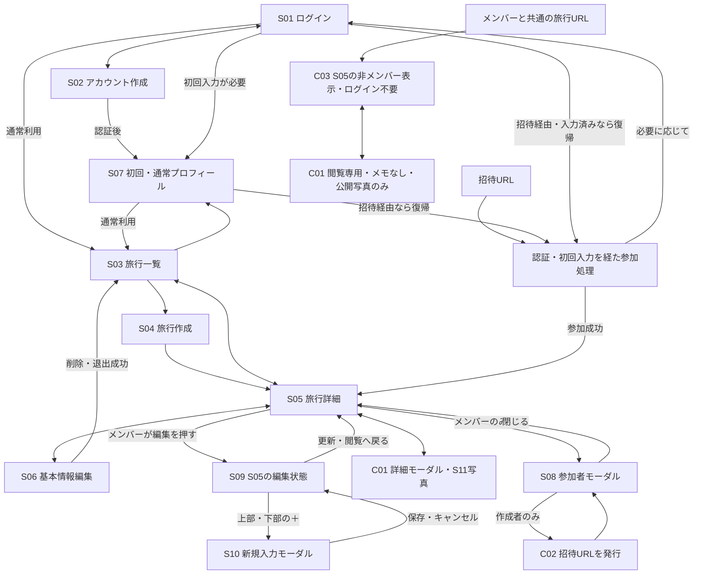

# MVP画面設計

## 1. 目的と位置付け

旅行帳のMVPに必要な画面の役割、表示情報、操作、画面遷移、URL構成を整理する。モバイル利用を主軸とし、計画・旅行中・旅行後に同じ旅行と旅程を使い続ける。

参照資料：

- [product.md](./product.md)：プロダクト思想
- [requirements.md](./requirements.md)：ユーザー向け仕様
- [data_model.md](./data_model.md)：論理データモデル
- [db-implementation.md](./db-implementation.md)：DB制約、RLS、Storage
- [decisions.md](./decisions.md)：設計判断の記録
- [AGENTS.md](../AGENTS.md)：開発上のルール

本書には、今回確定した画面構成・保存方法・公開範囲を反映する。画面構成が確定していても、URLの具体的な綴り、UIの細部、残る権限・入力仕様まで実装済みという意味ではない。UIライブラリ・配色・実装コードは決めない。

「機能面」は独立ページに限らず、同一ページの編集状態やモーダル内の機能を含む。S09・S11などのIDは機能の対応を追えるよう残すが、独立画面は作らない。C01〜C03も候補という意味ではなく、確定した詳細・招待・閲覧機能の識別子として使用する。

後の補足を優先し、**非メンバーはS08を閲覧できない。S05で人数のみ確認でき、C01のメモも閲覧できない。旅行閲覧にログインは不要**とする。当初の「C03からS08も閲覧可能」という案は採用しない。

本書の確定事項は関連する要件・論理モデル・DB設計・判断記録へ反映している。第9節に資料の対応と残る実装設計事項を示す。アプリケーションコード・DB・migrationへの適用は未実施。

## 2. MVPの画面・機能面一覧

| ID | 画面・機能面 | 確定した構成 | URLルート案・所属先 |
| --- | --- | --- | --- |
| S01 | ログイン | 独立ページ | `/login` |
| S02 | アカウント作成 | 独立ページ | `/signup` |
| S03 | 旅行一覧 | 複数旅行への入口となるページ | `/trips` |
| S04 | 旅行作成 | 独立ページ | `/trips/new` |
| S05 | 旅行詳細・日別旅程 | 旅行の中心ページ。「編集」で旅程を編集可能にする | `/trips/[tripId]` |
| S06 | 旅行基本情報編集 | 独立ページ | `/trips/[tripId]/settings` |
| S07 | 自分のプロフィール | 初回入力と通常の編集で共用するページ | `/profile` |
| S08 | 参加メンバー一覧 | S05上のモーダル。メンバーのみ利用可能 | S05のURL内 |
| S09 | 旅程編集 | 独立画面なし。S05の編集モードとして実現 | S05のURL内 |
| S10 | 旅程アイテム追加 | リスト上部・下部の＋から、カテゴリ選択→内容入力→挿入箇所選択。新規入力モーダルに保存・キャンセルを設ける | S05の編集モード内 |
| S11 | 写真閲覧・追加・編集・振り返り | C01に内包。専用写真一覧・振り返りページは作らない | C01内 |
| C01 | 旅程アイテム詳細 | 1アイテムの詳細モーダル。メモ・写真機能を内包 | S05のURL内 |
| C02 | メンバー招待・参加 | 作成者がS08から招待。受け取る人は招待URLから参加 | 招待操作はS08内。参加URLの形式は未決定 |
| C03 | 非メンバー向け閲覧 | ログイン不要。S05とC01を閲覧専用にする。S08・メモは非公開 | メンバーと同じ `/trips/[tripId]` |

独立ページの採否、S07の初回共用、S08・C01のモーダル化、S09・S11の内包先は確定事項とする。不要になった旅程編集・アイテム詳細・写真一覧・メンバー一覧の独立ルートは設けない。モーダルの開閉状態をクエリ等で表すかは未決定。

管理画面、公開旅行検索、SNS、複数メモの投稿、旅行の複製、地図・交通検索、AIプラン、天気、アカウント削除など、今回のMVP要件にない機能・画面は追加しない。

## 3. 共通の表示・操作方針

### 3.1 モバイル利用

- 旅行名・選択日・操作対象が分かる縦方向中心の構成とし、ホバー操作を前提にしない。
- 日付切替は旅程一覧上部のタブを基本とする。長い旅行でのスクロール方法やプルダウンへの切替条件は未決定。
- S08・C01と新規入力はモーダルで扱う。小さな端末で十分な入力・閲覧領域を確保し、閉じる操作と保存結果を区別する。モーダルの大きさや内部の画面切替は未決定。
- 並び替えの操作方法は未決定。ドラッグ＆ドロップ・上下移動ボタン等から、タッチ操作に適した方法を決める。
- 読み込み中・未保存・保存中・成功・失敗を区別する。保存できていない内容を成功扱いにしない。

### 3.2 旅程の基本表示

同じ旅行・日付では `sort_order` によるユーザー指定順を正式な順序とする。`place` と `transportation` を1つの連続した旅程として表示する。時刻・時間帯・推定時刻を理由に並び替えない。

| ユーザー指定順 | 種別 | 内容 | 補助情報の例 |
| --- | --- | --- | --- |
| 1 | place | 東京駅 | 09:00 |
| 2 | transportation | 新幹線 | 所要時間120分 |
| 3 | place | ホテルに荷物を預ける | 時刻指定なし |
| 4 | place | 昼食 | 設定した時間帯 |

時刻がなくても通常のアイテムとして同じ流れに表示する。未設定を00:00に置き換えたり、別の「時刻なし一覧」へ移したりしない。時間欄を省略するか未設定ラベルを表示するかは未決定。

`place` は場所、その場所で行うこと、滞在中の行動を含む。`action` は追加しない。時刻・時間帯・所要時間は任意で設定できる補助情報とする。

旅行後もS05から日付・アイテムを選び、C01の写真と合わせて振り返る。旅行全体の写真を一括表示する専用ページは作らない。写真自体の並び順は旅程順とは別の未決定事項とする。

### 3.3 操作権限

非メンバーには未ログインの閲覧者と、ログイン済みで当該旅行に参加していないユーザーを含む。

| 操作・表示 | 作成者 | 作成者以外のメンバー | 非メンバー |
| --- | --- | --- | --- |
| S05の旅行・日別旅程の閲覧 | 可 | 可 | ログイン不要で可 |
| S06の基本情報編集 | 可 | 可 | 不可 |
| S05の編集モード、アイテム追加・編集・並び替え・削除 | 可 | 可 | 不可 |
| S08の参加者一覧、表示名・プロフィール画像 | 可 | 可 | 不可。人数のみS05で表示 |
| C01のアイテム基本情報 | 可 | 可 | 閲覧のみ |
| C01のメモの閲覧・追加・編集 | 可 | 可 | 閲覧も不可 |
| C01内の写真閲覧 | 全写真 | 全写真 | 公開が許可された写真のみ |
| C01内の写真追加 | 可 | 可 | 不可 |
| 写真の公開設定変更・差し替え・単独削除 | 個別の範囲・権限は未決定 | 個別の範囲・権限は未決定 | 不可 |
| S08からの招待 | 可 | 不可 | 不可 |
| 旅行そのものの削除 | 可 | 不可 | 不可 |
| 自分の旅行からの退出 | 不可 | 可 | 対象外 |

作成者もメンバーに含まれる。通常の閲覧・編集用roleは増やさず、作成者だけの招待・旅行削除は `trips.created_by` で判定する。他者の強制退出・作成者移譲は追加しない。自分のプロフィール編集は本人の認証が必要で、旅行の公開閲覧とは別の権限とする。

写真は `is_public = false` がメンバー限定、`true` が非メンバーにも閲覧を許可できる写真で、既定値はfalse。C03でもfalseの写真を表示しない。ログイン不要は確定しているが、旅行単位の公開範囲の値や、非公開旅行の写真単独公開などは別途決定する。

### 3.4 GUIとデータ取得の境界

非メンバーには編集・追加・招待の操作を表示せず、API・DBでも拒否する。S08へ進む入口は与えず、C01のメモも返さない。表示名・画像・メモを取得した後にGUIだけで隠す設計にはしない。

人数は対象旅行について件数のみ返す経路を設け、ブラウザへ参加者行を渡して数えさせない。公開写真に付随する投稿者情報からも、メンバー名・プロフィール画像を漏らさない。

RLSは行単位の制御であり、公開する旅程行の `description` だけを自動的に隠すものではない。非メンバー向けの取得経路は、メモを含まない項目だけを返し、基礎テーブルへの直接アクセスでもメモを取得できないようSQL権限・安全な投影・関数等を組み合わせて設計する。メンバー向けの取得・編集権限は維持する。詳細なDB実装は第9節の追随事項とする。

## 4. 各画面・機能面

### S01 ログイン

- **目的**：既存ユーザーが自分の旅行やプロフィールを利用し、招待から参加できるようにする。
- **URLルート案**：`/login`。独立ページ。
- **主に表示する情報**：認証方式に応じた入力・認証操作、処理結果、アカウント作成への入口。
- **ユーザーが行える操作**：ログイン、S02への移動。
- **遷移元**：認証が必要な操作、S02、未認証で招待URLを開いた場合。C03の閲覧にはログインを要求しない。
- **遷移先**：プロフィール未作成ならS07。通常利用はS03、招待経由なら認証後に参加処理へ復帰する構成とする。
- **未決定事項**：認証方式、具体的な認証入力・確認経路、認証期限切れ時の未保存内容の扱い。

### S02 アカウント作成

- **目的**：旅行帳で参加・編集するためのアカウントを作る。
- **URLルート案**：`/signup`。独立ページ。
- **主に表示する情報**：認証方式に応じた登録項目・処理結果。表示名と任意の画像はS07で初回入力する。
- **ユーザーが行える操作**：登録、S01への移動。
- **遷移元**：S01、招待URLからの登録経路。
- **遷移先**：必要な認証確認を経てS07。認証確認の具体的方式は未決定。
- **未決定事項**：認証方式、メール確認等の要否、認証処理を中断した場合の再開方法。S07を初回入力に使うことは確定済み。

### S03 旅行一覧

- **目的**：ユーザーが作成・参加している複数の旅行を開き、計画や振り返りを再開する。
- **URLルート案**：`/trips`。
- **主に表示する情報**：参加旅行の旅行名、開始日・終了日、任意のサムネイル。作成者自身もメンバーとして対象に含める。
- **ユーザーが行える操作**：旅行を開く、新しい旅行を作る、自分のプロフィールへ移動する。
- **遷移元**：通常のログイン・初回プロフィール入力完了後、S05・S07から戻る、S06で削除・退出に成功した後。
- **遷移先**：S05、S04、S07。
- **未決定事項**：一覧順、過去・今後の分け方、サムネイル未設定時の表現、大量データの読み込み。検索・絞り込みは追加しない。
- **空の状態**：参加旅行がないことと旅行作成への入口を示す。非メンバーの公開閲覧は、個人の旅行一覧を経由せず旅行URLから行える。

### S04 旅行作成

- **目的**：新しい旅行の基本情報を登録する。
- **URLルート案**：`/trips/new`。独立ページ。
- **主に表示する情報**：旅行名、開始日・終了日、任意のサムネイル入力。
- **ユーザーが行える操作**：入力、作成、取りやめ。終了日は開始日以降とし、同日旅行を許可する。
- **遷移元**：S03。
- **遷移先**：作成成功後はS05、取りやめ時はS03。作成後、作成者はS05のS08からメンバーを招待する。
- **未決定事項**：サムネイル入力の細部と画像制限、日付の初期値、旅行名の空文字・文字数制限、離脱時の入力保持。
- **整合性**：旅行本体と作成者の参加登録が成立してから成功扱いにする。旅程が空でもS05を表示できる。

### S05 旅行詳細・日別旅程

- **目的**：概要と日別の連続した旅程を確認し、計画・旅行中・旅行後を同じページで扱う。
- **URLルート案**：`/trips/[tripId]`。メンバー・非メンバー共通。選択日を保持する場合の `?date=YYYY-MM-DD` は案とする。
- **主に表示する情報**：旅行名、期間、任意のサムネイル、参加人数、日付タブ、選択日のアイテムのタイトル・種別・任意の時間情報。メモ・写真の操作先はC01。
- **ユーザーが行える操作**：日付切替、アイテムを押してC01を開く。メンバーは「編集」でS09の編集モードへ切替、S06へ移動、S08を開く。非メンバーは人数のみ確認でき、S08を開けない。
- **遷移元**：S03、S04の作成成功、S06から戻る、招待からの参加完了、旅行URLへの直接アクセス。
- **遷移先**：メンバーはS03・S06、同ページ上のS08・C01・編集モード。非メンバーは閲覧専用C01を開く。
- **未決定事項**：初期選択日、日付・スクロール位置の保持、編集モードを離れるときの未保存内容。
- **空の状態**：旅程未登録と分かる表示を行う。メンバーは編集モードから追加できる。非メンバーには追加操作を出さない。

### S06 旅行基本情報編集

- **目的**：メンバーが基本情報を編集し、権限に応じて旅行削除・退出を行う。
- **URLルート案**：`/trips/[tripId]/settings`。独立ページ。
- **主に表示する情報**：旅行名、開始日・終了日、サムネイル。作成者には旅行削除、他メンバーには自分の退出の入口。
- **ユーザーが行える操作**：基本情報の編集・保存、戻る。作成者のみ旅行削除、作成者以外のみ退出。
- **遷移元**：メンバーが閲覧するS05。
- **遷移先**：編集後・戻る操作はS05。削除・退出成功後はS03。
- **未決定事項**：保存・確認UI、旅行期間短縮時の範囲外アイテムの扱い、サムネイル削除UI、画像の後始末失敗の案内。
- **削除と退出**：旅行削除は参加・旅程・写真情報の削除と画像の後始末を伴う。退出は自分の参加状態だけを変え、旅行を消さない。非メンバーはURLへの直接アクセスでも編集できない。

### S07 自分のプロフィール

- **目的**：初回の表示名・任意の画像を入力し、その後も同じ画面で自分のプロフィールを編集する。
- **URLルート案**：`/profile`。
- **主に表示する情報**：表示名、任意のプロフィール画像、初回入力または通常編集の状態、保存結果。
- **ユーザーが行える操作**：本人の表示名・画像の入力と保存。初回は作成、既存プロフィールは更新として扱う。表示名の重複は許可する。
- **遷移元**：認証後の初回入力、プロフィール未作成状態からの再開、S03の編集入口。
- **遷移先**：通常はS03。招待経由では参加処理へ復帰し、参加成立後にS05へ進む。
- **未決定事項**：空文字・文字数制限、画像の選択・削除・容量・形式、初回入力の途中離脱時の再開UI。
- **境界**：非メンバーとして旅行を閲覧するだけなら、登録・S07入力は要求しない。招待で編集可能なメンバーになる際は認証ユーザーを識別する。

### S08 参加メンバー一覧モーダル

- **目的**：メンバーが参加者を確認し、作成者が招待を行う。
- **URLルート案**：S05のURL内。独立ページなし。
- **主に表示する情報**：メンバーの表示名と任意のプロフィール画像。作成者にのみ招待操作を表示する。
- **ユーザーが行える操作**：参加者確認、モーダルを閉じる。作成者のみC02の招待操作を行える。
- **遷移元**：メンバーが閲覧するS05。
- **遷移先**：閉じてS05へ戻る。招待操作は同じS08内で行う。
- **未決定事項**：一覧順、作成者の表示表現、モーダル内の招待UI。表示名・画像のメンバー向け取得経路はDB設計の追随が必要。
- **非メンバー**：モーダルは開けず、参加者データも取得できない。人数のみS05へ返す。

### S09 旅程編集（S05の編集モード）

- **目的**：ユーザー指定順の旅程を編集する。専用画面は作らない。
- **URLルート案**：S05と同じ。S05の「編集」で編集可能になる。
- **主に表示する情報**：選択日、旅程リスト、リスト上部と下部の＋、編集・削除・並び替え操作、更新ボタン、保存状態。
- **ユーザーが行える操作**：メンバーによる旅程編集。＋からS10を開始する。既存旅程の変更は更新ボタンで保存するが、新規アイテム・メモ・写真には第7節の保存方法を適用する。
- **遷移元**：S05の「編集」、S10からの復帰。
- **遷移先**：同ページ上のS10・C01、S05の閲覧状態。
- **未決定事項**：並び替え方法、既存旅程の保存範囲を日単位か旅行全体にするか、日付切替・離脱時の未保存処理、タイトル・時刻等の編集UI、同時編集競合時の処理。
- **注意**：更新ボタンで保存する旅程データと、既に即保存されたメモ・写真・新規アイテムを区別する。編集モードの変更破棄で、後者まで取り消す挙動にしない。

### S10 旅程アイテム追加フロー

- **目的**：カテゴリ・内容・挿入箇所を順に指定して、新しいアイテムを追加する。
- **URLルート案**：S05の編集モード内。新規入力はモーダルで行い、独立ページは作らない。
- **主に表示する情報**：対象日、カテゴリ選択、内容入力、挿入箇所選択、必要なメモ・写真入力、保存・キャンセルボタン。
- **ユーザーが行える操作**：リスト上部または下部の＋ → カテゴリ選択 → 内容入力 → 挿入箇所選択 → 保存。途中でキャンセルできる。
- **遷移元**：S05の編集モードの上部・下部の＋。
- **遷移先**：保存成功またはキャンセル後にS05の編集モードへ戻る。
- **未決定事項**：各ステップの配置、挿入位置の選択UI・初期値、空リストでの＋の配置、日付の初期値・変更方法、入力制限。新規モーダルの保存・キャンセルと選択順序は確定済み。
- **挿入位置**：上と下の＋はいずれも追加フローの入口とし、最後に選択した位置を採用する。上の＋を押しただけで先頭、下の＋だけで末尾へ確定しない。
- **新規保存**：入力したアイテム本体、メモ、選択した写真をモーダルの「保存」で合わせて登録する。S05の「更新」をもう一度押さないと新規アイテムが保存されない設計にはしない。キャンセルでは新規データを確定しない。

入力とモデルの対応：

| 項目 | 条件 |
| --- | --- |
| 日付 | 原則旅行期間内。MVPではアプリで検証 |
| カテゴリ | `place` / `transportation` |
| タイトル | 必須。空文字・文字数制限は未決定 |
| メモ | 任意の単一テキスト。`itinerary_items.description` に対応 |
| 時間指定なし | `time_type = none`、時刻・時間帯ともNULL |
| 正確な時刻 | `time_type = exact`、時刻必須・時間帯NULL |
| 大まかな時間帯 | `time_type = period`、時間帯必須・時刻NULL |
| 所要時間 | 任意の正の整数の分数。placeは滞在時間、transportationは移動時間 |
| 挿入箇所 | 日付内のユーザー指定順を `sort_order` に反映 |
| 写真 | 同じアイテムに複数登録可能。新規時は親アイテムと合わせて保存 |

時間指定方法の変更では不要な値を保存せず、DB CHECKに一致させる。時間帯の具体的な値は独断で決めない。

### S11 写真機能（C01に内包）

- **目的**：アイテムに紐付く複数写真を閲覧・追加・編集し、旅程とともに振り返る。
- **URLルート案**：C01内。独立した写真一覧・振り返りルートは設けない。
- **主に表示する情報**：アイテムに対応する写真、メンバー向けの写真公開可否、アップロード・保存状態。非メンバーに投稿者の表示名やプロフィール画像を返さない。
- **ユーザーが行える操作**：メンバーの写真閲覧・追加、仕様・権限が定まった範囲での写真編集。非メンバーは公開が許可された写真の閲覧のみ。
- **遷移元**：S05でアイテムを選択して開いたC01。新規時の写真入力はS10のモーダル内。
- **遷移先**：同じモーダル内。C01を閉じるとS05。
- **未決定事項**：「写真編集」の具体的範囲（公開設定変更・差し替え等）、設定・削除権限、写真順、拡大表示、複数ファイル選択、容量・形式・枚数、非公開旅行の写真単独公開。
- **保存**：既存アイテムのアップロードはモーダル内で即時に保存処理を行い、S05の更新を待たない。新規アイテムでは第7節どおりモーダルの保存まで確定しない。
- **振り返り**：過去の旅行もS03→S05→C01で旅程と写真を確認する。旅行終了を理由に自動で編集禁止にしない。撮影日時・EXIF・コメントを必須情報として追加しない。

### C01 旅程アイテム詳細モーダル

- **目的**：アイテムの内容を詳しく確認し、1つのテキストメモと写真を扱う。
- **URLルート案**：S05のURL内。アイテムを押すとモーダルで開く。
- **主に表示する情報**：日付、種別、タイトル、任意の時間情報。メンバーには共有メモと全写真、非メンバーにはメモを除く情報と公開が許可された写真だけを表示する。
- **ユーザーが行える操作**：内容閲覧、モーダルを閉じる。メンバーはメモの追加・編集と写真追加・編集機能を利用する。写真編集の具体的な範囲・権限は残件とする。
- **遷移元**：S05の旅程アイテム。
- **遷移先**：閉じるとS05。メモ・写真の操作はC01内で完結する。
- **未決定事項**：メモの即保存を開始するイベント（入力停止・フォーカス離脱等）、保存中の閉じる操作、既存のタイトル・時刻等の編集入口、写真編集の詳細。
- **メモ**：アイテムごとに1つの単純なテキストで、`description` を利用する。複数のメモ投稿・コメント・写真ごとの説明欄にはしない。任意入力を維持する。
- **保存**：既存アイテムのメモはモーダル内で即保存する。S05の「更新」へ持ち越さない。写真アップロードも同様。新規アイテムのメモ・写真入力ではS10の「保存」「キャンセル」を使用する。
- **公開**：非メンバーにはメモの本文・入力欄・編集操作を出さず、データも取得させない。

### C02 メンバー招待・URLからの参加

- **目的**：旅行作成者がメンバーを招待し、受け取ったユーザーが参加できるようにする。
- **URLルート案**：招待操作はS08内。参加は招待URLから行う。招待URLのパスやトークンの形式は未決定。
- **主に表示する情報**：作成者には招待操作と参加用URL。受け取る側には対象旅行と参加処理に必要な案内。
- **ユーザーが行える操作**：作成者のみ招待を行える。受け取った人は招待URLから参加する。単に旅行の閲覧URLを開いただけでは参加させない。
- **遷移元**：招待する側はS08。受け取る側は招待URL。
- **遷移先**：招待操作後はS08。参加成立後はS05。未認証ならS01・S02、初回プロフィールが必要ならS07を経由して参加処理へ戻る。
- **未決定事項**：招待URLの有効期限・再利用・失効・転送可否、参加確認の操作、URLの配布UI、参加前に見せる案内、参加URLの具体的形式。
- **権限**：MVPでは招待可能なのは作成者のみ。GUIだけでなくDB側でも発行権限と参加条件を検証する。参加が成立すると通常メンバーとして編集権限を得る。
- **認証**：閲覧はログイン不要だが、参加は `trip_members.user_id` に対応する認証ユーザーを識別して行う。公開閲覧URLと、参加資格を確認する招待URLは役割を分離する。

### C03 非メンバー向け閲覧

- **目的**：ログインせずに旅行と旅程・公開写真を閲覧できるようにする。
- **URLルート案**：メンバーと同じ `/trips/[tripId]`。非メンバー専用の旅行ページは作らない。
- **主に表示する情報**：S05の旅行・日別旅程と参加人数、C01の基本情報と公開が許可された写真。S08の参加者情報とメモは表示しない。
- **ユーザーが行える操作**：日付切替、C01を開く・閉じる、許可された写真の閲覧。編集・追加・削除・招待・公開設定変更は不可。
- **遷移元**：旅行URLへの直接アクセスや共有。閲覧のためにS01へ誘導しない。
- **遷移先**：同ページ内の閲覧専用C01。S08には遷移できない。
- **未決定事項**：旅行URLを配布するUI、旅行単位の公開範囲の値や制御方式、非公開旅行の写真単独公開、アクセス失効時の表示。ログイン不要・共通URL・人数のみ・メモ非公開は確定済み。
- **境界**：未ログインでもログイン済み非メンバーでも同じ制限を適用する。閲覧のために参加行を作らず、参加者一覧やメモを返すAPIも公開しない。一般的な旅行検索や公開一覧の追加は意味しない。

## 5. 主要な画面遷移

矢印は別ページへの遷移だけでなく、モーダルの開閉・編集状態の切替を含む。編集専用ページ・写真専用ページへ分岐する以前の案は削除する。

主な利用シナリオ：

1. **初回利用**：アカウント作成 → 必要な認証確認 → S07で表示名・任意画像を入力 → 旅行一覧。
2. **旅程を作る**：旅行一覧 → 旅行作成 → S05の「編集」 → 上部または下部の＋ → カテゴリ → 内容 → 挿入箇所 → モーダルの「保存」。新規アイテム・メモ・写真を登録してリストへ戻る。
3. **既存旅程を編集する**：S05の「編集」 → 既存内容・順序を変更 → 「更新」。メモ・写真はこの更新待ちの対象外。
4. **旅行中の記録・旅行後の振り返り**：S05で日付・アイテムを選択 → C01でメモと写真を確認。メンバーの既存メモ変更・写真アップロードは即保存。
5. **招待する**：作成者がS05→S08→招待URL発行。受け取った人は招待URL→必要な認証・初回入力→参加処理→S05。
6. **非メンバーが見る**：同じ旅行URL→ログイン不要のS05→閲覧専用C01。人数は見えるがS08・メモ・非公開写真は見えない。
7. **削除・退出する**：S05→S06→権限に応じて旅行削除／退出→成功後にS03。失敗時に成功扱いにしない。

## 6. URLとモーダルの扱い

- `/login`、`/signup`、`/trips`、`/trips/new`、`/trips/[tripId]`、`/trips/[tripId]/settings`、`/profile` をページのルート案とする。独立ページ構成は確定、綴りは実装時の技術判断として調整可能。
- S08、S09、S10、S11、C01はS05上で扱う。専用のメンバー一覧・旅程編集・アイテム追加／詳細・写真ページは作らない。モーダルの状態をURLやブラウザ履歴へ反映するかは未決定。
- C03はS05と同じURLを使う。ルート全体を一律ログイン必須にしない。一方、S03・S04・S06・S07の個人利用・編集操作は認証が必要。
- C02の招待URLは旅行の閲覧URLとは異なる役割を持つ。単なる旅行IDから参加を許可しない。具体的なパス・検証方法は招待管理の詳細設計で決める。
- `/` からの誘導は未決定。新しいランディングページは追加しない。
- 日付は旅行内の選択状態とし、`trip_days` や日別の管理画面は追加しない。
- モーダルの対象アイテムが旅行に属すること、操作時の権限、削除済み状態を検証する。存在しない日付や削除済みアイテムへのアクセス時の案内は実装前に決める。

## 7. 保存方法と状態管理

### 7.1 確定した保存単位

| 対象 | 保存タイミング | キャンセル・閉じる操作との関係 |
| --- | --- | --- |
| 既存旅程の基本項目・順序等 | S05の編集モードの「更新」 | 未保存部分の破棄UIは未決定 |
| 既存アイテムのメモ | C01内で即保存。S05の更新を待たない | 保存済みの変更を、閉じる・旅程編集の破棄で取り消さない |
| 既存アイテムの写真アップロード | C01内で即時に保存処理 | 登録済み写真を閉じるだけで削除しない |
| 新規アイテム・メモ・写真 | 新規入力モーダルの「保存」で合わせて登録 | 「キャンセル」は新規入力・写真選択を破棄し、登録を確定しない |
| 写真の公開設定変更・差し替え等 | 写真編集の範囲と権限の決定時に具体化 | 写真アップロードの即保存とは別に決める |
| 旅行基本情報・プロフィール | S06・S07でそれぞれ保存 | S05の更新対象には含めない |

従来の「旅程は最後に更新ボタンで保存する」というルールを、すべての操作へ一律に適用しない。今回の補足により、新規作成はモーダル保存、既存メモ・写真アップロードは即保存という保存方法が確定した。新規作成の成功をS05の更新待ちの状態として表示しない。

即保存とは、S05の更新やモーダルを閉じる操作を待たず保存することを指す。メモ入力の各キー入力・入力停止・フォーカス離脱のどのイベントで送信するかは未決定であり、保存中・成功・失敗を利用者に示す。

### 7.2 新規アイテムと写真の登録

モーダル内で写真を選択できるが、「保存」前には親アイテムや写真を登録済みとして扱わない。「保存」で親アイテム、メモ、写真の登録を一連の処理として行う。

DBの親行・写真メタデータとStorageの画像本体は同じトランザクションにはならない。「同時に保存」はユーザーの1回の保存操作で合わせて登録する意味であり、画像アップロードまでDBトランザクションで原子的に処理できることを意味しない。

実装では、一時アップロード・親行作成・写真行登録の順序、途中失敗の補償、再試行時の重複防止を設計する。選択中・保存中・失敗・成功を区別し、途中までの成功を「すべて保存済み」と表示しない。保存前キャンセル時の一時ファイルの後始末、保存途中のキャンセル可否・部分失敗時の具体的なUIは未決定。

新規入力中に既存旅程の並び替え等も未保存の場合、挿入位置の確定と親リストの未保存内容が干渉する。先に既存変更の更新を求める、両操作を整合する保存手順にする等の方法は実装前に選ぶ。未保存の別アイテムへの依存や順序の競合を黙って確定しない。

### 7.3 独立して保存した内容を上書きしない

S05の旅程更新で古い `description` を再送し、C01の即保存メモを巻き戻さない。新規保存済みアイテム・写真を、古いリストを使う一括更新で消さない。変更対象の項目を分け、保存成功を画面状態へ反映する必要がある。

メモ・写真の編集開始をS05の編集モードに限定するかどうか、既存タイトル・時刻等の編集UIの細部は未決定だが、既存メモ・写真アップロードをS05の更新待ちに戻すことはしない。

### 7.4 共通状態

| 状態 | 必要な扱い | 残る判断 |
| --- | --- | --- |
| 読み込み中 | 未取得を「旅行なし」「写真なし」と確定表示しない | 表示形式 |
| 空の旅行・日付・写真 | 空の理由と権限に合う操作を提示 | 文言・配置 |
| 未保存の旅程 | 即保存済みデータと明確に分ける | 日付変更・離脱時の保持／破棄 |
| 保存・アップロード失敗 | 保存失敗を伝え、成功済みの範囲と区別 | 再試行、部分成功、閉じる操作 |
| 同時編集・権限喪失 | 保存時にも権限・対象状態を再確認 | 競合通知・再読込・上書き方針 |
| 旅行・アイテム削除 | 関連写真の削除と画像の後始末が必要 | 確認UI・画像削除失敗の案内 |
| 非公開化・退出 | データ取得と画像配信にも権限変更を反映 | 発行済み画像URLの失効方針 |

オフライン保存や自動同期は追加しない。C01のメモの即保存を、旅程全体の自動保存へ拡張しない。

## 8. 残る未決定事項

以下は今回の確定事項と区別する。解決済みの画面分割やログイン要否を未決定へ戻さない。

| 分類 | まだ決める内容 |
| --- | --- |
| 認証 | 認証方式、メール確認等、初回入力の途中離脱・再開 |
| 旅程編集 | 既存タイトル・時刻等の編集UI、並び替え方法、更新範囲、日付切替・離脱時の未保存処理、同時編集 |
| 新規追加 | ステップの配置、挿入箇所の選択UI・初期値、既存未保存変更との整合、途中失敗・キャンセル・再試行 |
| 即保存 | メモ送信の契機、保存中に閉じる操作、S05編集モードとの操作開始条件 |
| 写真編集 | 公開設定変更・差し替え・単独削除等の具体的範囲と権限、写真順、拡大表示、形式・容量・枚数、複数選択 |
| 招待URL | 有効期限、再利用、失効、転送可否、参加確認、配布UI、URL形式。招待者は作成者、入口はS08、参加はURLで確定 |
| 公開制御 | 旅行単位の公開範囲の値・管理方法、非公開旅行の写真単独公開、公開設定者、画像URL失効。ログイン不要・共通URL・S08とメモ非公開は確定 |
| 旅行期間短縮 | 既存の範囲外アイテムの処理。自動削除・移動・拒否を独断で選ばない |
| 入力・表示 | 文字数・空文字、時間帯の値、海外・日跨ぎ時の時刻表現、画像入力の細部、一覧順・日付初期値 |
| モーダル・戻る | 開閉の履歴／URL表現、スクロール位置復元、保存途中の戻る操作 |

## 9. 関連資料と残る実装設計

本書の確定事項をdocs内の関連資料へ反映した。確定済みの内容と未決定事項を分け、実装前に以下の技術設計を具体化する。

| 参照先 | 反映した内容・残る設計 |
| --- | --- |
| [requirements.md](./requirements.md) | ログイン不要・共通URL、人数のみ・メモ非公開、作成者だけの招待、新規モーダル保存と即保存の例外を反映 |
| [data_model.md](./data_model.md) | 単一共有メモの意味と非公開、参加者行と人数の分離、S07初回作成、招待の責務を反映。招待管理の構造は詳細仕様決定後に設計 |
| [db-implementation.md](./db-implementation.md) | 公開用の許可列取得、人数取得、S08用プロフィール取得、作成者限定招待と参加検証、写真・Storage認可、保存単位を設計。公開制御・招待条件・失敗補償の詳細を実装前に具体化 |
| [decisions.md](./decisions.md) | 現行の確定事項と理由・残件を記録 |

メモを含む旅程行をそのまま公開せず、人数公開のために参加者行を返さない。画像配信にも同じ認可を適用し、招待では自由な自己加入を許可しない。DB設計が更新されたことと、実装・検証が完了したことは区別する。

今回の修正対象はdocs内のため、ルートの [AGENTS.md](../AGENTS.md) は変更していない。同ファイルには非参加者閲覧のログイン要否等を未決定とする旧記述が残るが、ユーザーが確定した本書の仕様を優先し、次回のルール更新で追随する。

## 10. 設計レビューの確認項目

- 独立ページとして決めた画面は独立し、S08・C01はモーダル、S09はS05の編集状態、S11はC01内となっている。
- 初回プロフィールはS07を使い、招待経由なら認証・初回入力後に参加処理へ戻れる。
- 上下の＋からカテゴリ→内容→挿入箇所の順で追加でき、新規モーダルに保存・キャンセルがある。
- 新規アイテムとメモ・写真はモーダル保存、既存メモ・写真アップロードは即保存、その他の既存旅程変更はS05の更新で保存される。
- 即保存したメモや新規登録を、古い旅程の一括更新・キャンセルで巻き戻さない。
- 時刻なしのplaceとtransportationが日付ごとに `sort_order` で連続表示され、任意の時間情報を理由に順序が変わらない。
- 複数旅行・サムネイルなし・旅程なし・写真なしでも利用でき、旅程と写真をC01で振り返れる。
- 招待は作成者だけがS08から行い、URLから認可された参加だけが成立する。
- 非メンバーはログイン不要で同じ旅行URLを閲覧できるが、人数以外の参加者情報・メモ・非公開写真を取得できない。
- GUIだけでなくAPI・DB・Storageでも公開範囲と書き込み権限を保証する。
- 解決済み事項を未決定一覧へ残さず、残る写真編集・招待URLの条件等を独断で確定しない。
